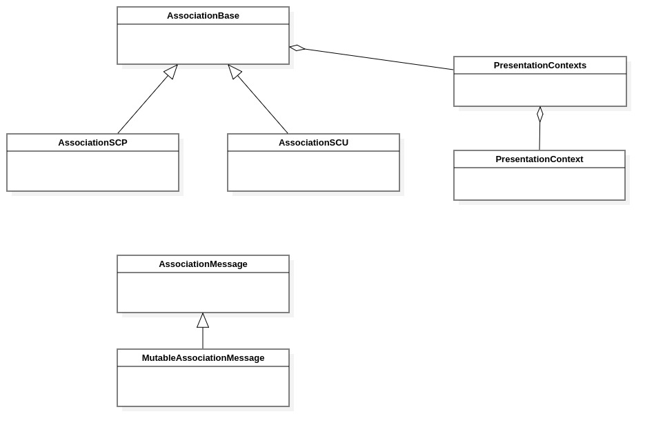
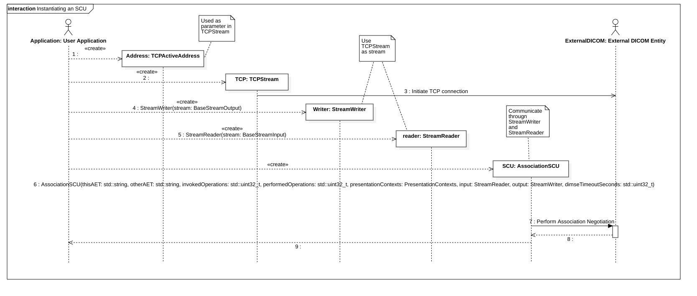

ACSE classes
============

Introduction
------------

This chapter describes the ACSE related classes and methods. ACSE stands for (Association Control Service Element).

The following classes are described in this chapter:

+-----------------------------------------------+---------------------------------------------+-------------------------------+
|C++ class                                      |Objective-C/Swift class                      |Description                    |
+===============================================+=============================================+===============================+
|:cpp:class:`imebra::PresentationContext`       |:cpp:class:`ImebraPresentationContext`       |Stores an abstract syntax and  |
|                                               |                                             |the list of allowed transfer   |
|                                               |                                             |syntaxes                       |
+-----------------------------------------------+---------------------------------------------+-------------------------------+
|:cpp:class:`imebra::PresentationContexts`      |:cpp:class:`ImebraPresentationContexts`      |Stores a list of Presentation  |
|                                               |                                             |contexts                       |
+-----------------------------------------------+---------------------------------------------+-------------------------------+
|:cpp:class:`imebra::AssociationMessage`        |:cpp:class:`ImebraAssociationMessage`        |Stores a message sent through  |
|                                               |                                             |an association                 |
+-----------------------------------------------+---------------------------------------------+-------------------------------+
|:cpp:class:`imebra::MutableAssociationMessage` |:cpp:class:`ImebraMutableAssociationMessage` |A mutable message (used to     |
|                                               |                                             |create a message)              |
+-----------------------------------------------+---------------------------------------------+-------------------------------+
|:cpp:class:`imebra::AssociationBase`           |:cpp:class:`ImebraAssociationBase`           |Base class for the associations|
+-----------------------------------------------+---------------------------------------------+-------------------------------+
|:cpp:class:`imebra::AssociationSCU`            |:cpp:class:`ImebraAssociationSCU`            |An SCU association (Service    |
|                                               |                                             |user)                          |
+-----------------------------------------------+---------------------------------------------+-------------------------------+
|:cpp:class:`imebra::AssociationSCP`            |:cpp:class:`ImebraAssociationSCP`            |An SCP association (service    |
|                                               |                                             |provider)                      |
+-----------------------------------------------+---------------------------------------------+-------------------------------+

   Class diagram of the ACSE related classes

The ACSE classes (Association Control Service Element) take care of negotiating a DICOM association and transporting DICOM 
messages between DICOM entities connected through the association.

The client (Service User or SCU) must use :ref:`AssociationSCU` to connect, while the server (Service Provider or SCP) must
use :ref:`AssociationSCP` to connect with a client.

The association usually transmits and receive data via a :ref:`TCPStream`, therefore the sequence of operations needed to
connect an SCU to a remote SCP are as follow:

- Create a :ref:`TCPStream` which connects to the remote SCP
- Allocate a :ref:`StreamReader` and a :ref:`StreamWriter` connected to the :ref:`TCPStream` input and output streams
  (use :cpp:member:`imebra::DataSet::getStreamInput` and :cpp:member:`imebra::DataSet::getStreamOutput`)
- Allocate a :ref:`PresentationContexts` and fill it with :ref:`PresentationContext` objects that represent the requested
  presentation contexts (abstract syntaxes and supported transfer syntaxes)
- Allocate a :ref:`AssociationSCU` which in the constructor will perform the association negotiation through the
  :ref:`StreamReader` and :ref:`StreamWriter`

   Sequence diagram that shows how to instantiate an SCU

Once the association has been allocated, the client should use a DimseService in order to send and receive DICOM commands
and responses.

Presentation context classes
----------------------------

.. _PresentationContext:

PresentationContext
...................

C++
,,,

.. doxygenclass:: imebra::PresentationContext
   :members:

Objective-C/Swift
,,,,,,,,,,,,,,,,,

.. doxygenclass:: ImebraPresentationContext
   :members:

PresentationContexts
....................

C++
,,,

.. doxygenclass:: imebra::PresentationContexts
   :members:

Objective-C/Swift
,,,,,,,,,,,,,,,,,

.. doxygenclass:: ImebraPresentationContexts
   :members:

Association classes
-------------------

.. _AssociationBase:

AssociationBase
...............

C++
,,,

.. doxygenclass:: imebra::AssociationBase
   :members:

Objective-C/Swift
,,,,,,,,,,,,,,,,,

.. doxygenclass:: ImebraAssociationBase
   :members:

AssociationSCU
..............

C++
,,,

.. doxygenclass:: imebra::AssociationSCU
   :members:

Objective-C/Swift
,,,,,,,,,,,,,,,,,

.. doxygenclass:: ImebraAssociationSCU
   :members:

AssociationSCP
..............

C++
,,,

.. doxygenclass:: imebra::AssociationSCP
   :members:

Objective-C/Swift
,,,,,,,,,,,,,,,,,

.. doxygenclass:: ImebraAssociationSCP
   :members:

Message payload class
---------------------

AssociationMessage
..................

C++
,,,

.. doxygenclass:: imebra::AssociationMessage
   :members:

Objective-C/Swift
,,,,,,,,,,,,,,,,,

.. doxygenclass:: ImebraAssociationMessage
   :members:

MutableAssociationMessage
.........................

C++
,,,

.. doxygenclass:: imebra::MutableAssociationMessage
   :members:

Objective-C/Swift
,,,,,,,,,,,,,,,,,

.. doxygenclass:: ImebraMutableAssociationMessage
   :members:

