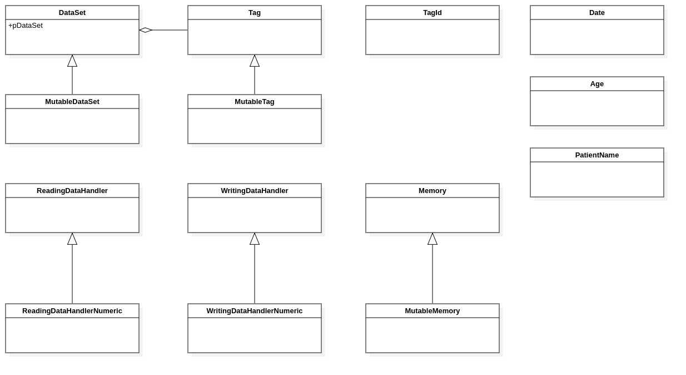
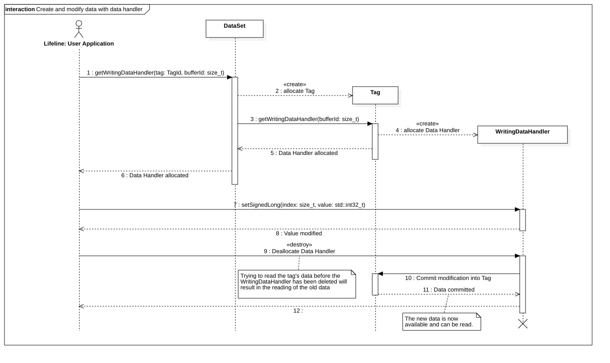

DICOM dataSet & tags classes
============================

Introduction
------------

This section describes the classes and methods responsible for storing, retrieving and setting the information that composes the
DICOM structure, represented by the class :ref:`DataSet`.

The following classes are described in this chapter:

+-----------------------------------------------+---------------------------------------------+-------------------------------+
|C++ class                                      |Objective-C/Swift class                      |Description                    |
+===============================================+=============================================+===============================+
|:cpp:class:`imebra::DataSet`                   |:cpp:class:`ImebraDataSet`                   |An immutable DICOM structure   |
+-----------------------------------------------+---------------------------------------------+-------------------------------+
|:cpp:class:`imebra::MutableDataSet`            |:cpp:class:`ImebraMutableDataSet`            |Mutable DICOM structure        |
+-----------------------------------------------+---------------------------------------------+-------------------------------+
|:cpp:class:`imebra::Tag`                       |:cpp:class:`ImebraTag`                       |A single immutable DICOM tag   |
+-----------------------------------------------+---------------------------------------------+-------------------------------+
|:cpp:class:`imebra::MutableTag`                |:cpp:class:`ImebraMutableTag`                |A single mutable DICOM tag     |
+-----------------------------------------------+---------------------------------------------+-------------------------------+
|:cpp:class:`imebra::TagId`                     |:cpp:class:`ImebraTagId`                     |Identifies a tag               |
+-----------------------------------------------+---------------------------------------------+-------------------------------+
|:cpp:class:`imebra::ReadingDataHandler`        |:cpp:class:`ImebraReadingDataHandler`        |Read data from a tag           |
+-----------------------------------------------+---------------------------------------------+-------------------------------+
|:cpp:class:`imebra::ReadingDataHandlerNumeric` |:cpp:class:`ImebraReadingDataHandlerNumeric` |Read data from a numeric tag   |
+-----------------------------------------------+---------------------------------------------+-------------------------------+
|:cpp:class:`imebra::WritingDataHandler`        |:cpp:class:`ImebraWritingDataHandler`        |Write into a tag               |
+-----------------------------------------------+---------------------------------------------+-------------------------------+
|:cpp:class:`imebra::WritingDataHandlerNumeric` |:cpp:class:`ImebraWritingDataHandlerNumeric` |Write into a numeric tag       |
+-----------------------------------------------+---------------------------------------------+-------------------------------+
|:cpp:class:`imebra::Date`                      |:cpp:class:`ImebraDate`                      |Stores a DICOM date/time       |
+-----------------------------------------------+---------------------------------------------+-------------------------------+
|:cpp:class:`imebra::Age`                       |:cpp:class:`ImebraAge`                       |Stores a DICOM Age             |
+-----------------------------------------------+---------------------------------------------+-------------------------------+
|:cpp:class:`imebra::PatientName`               |:cpp:class:`ImebraPatientName`               |Stores a patient name          |
+-----------------------------------------------+---------------------------------------------+-------------------------------+
|:cpp:class:`imebra::UnicodePatientName`        |                                             |Stores a patient name (unicode)|
+-----------------------------------------------+---------------------------------------------+-------------------------------+

   Class diagram of the data related classes

:ref:`DataSet` is a collection of :ref:`Tag` objects. Each :ref:`Tag` is identified by a :ref:`TagId`.

:ref:`DataSet` and :ref:`MutableDataSet` supply several functions that allow to easily read and write the value of the tags. However when advanced
functionalities are needed (e.g. when writing several items in one tag that accepts more than one value) then the classes
:ref:`ReadingDataHandler`, :ref:`ReadingDataHandlerNumeric`, :ref:`WritingDataHandler` and :ref:`WritingDataHandlerNumeric` should be used.

The difference between :ref:`ReadingDataHandlerNumeric` and :ref:`ReadingDataHandler` (and between :ref:`WritingDataHandlerNumeric` and
:ref:`WritingDataHandler`) is that the 'XXXNumeric' counterpart supplies functions to access the underlying memory buffer that stores
the data, allowing fast processing when dealing with images and large collections of data.

Data storage
------------

.. _DataSet:

DataSet
.......

C++
,,,

.. doxygenclass:: imebra::DataSet
   :members:

Objective-C/Swift
,,,,,,,,,,,,,,,,,

.. doxygenclass:: ImebraDataSet
   :members:

.. _MutableDataSet:

MutableDataSet
..............

C++
,,,

.. doxygenclass:: imebra::MutableDataSet
   :members:

Objective-C/Swift
,,,,,,,,,,,,,,,,,

.. doxygenclass:: ImebraMutableDataSet
   :members:

.. _Tag:

Tag
...

C++
,,,

.. doxygenclass:: imebra::Tag
   :members:

Objective-C/Swift
,,,,,,,,,,,,,,,,,

.. doxygenclass:: ImebraTag
   :members:

.. _MutableTag:

MutableTag
..........

C++
,,,

.. doxygenclass:: imebra::MutableTag
   :members:

Objective-C/Swift
,,,,,,,,,,,,,,,,,

.. doxygenclass:: ImebraMutableTag
   :members:

Data access
------------

The data handler allow to read and write the data stored in the tags.

In order to write data into a tag you can:

- use the helper methods in :ref:`DataSet`
- obtain a :ref:`WritingDataHandler` for the desidered tag and use it to write the data.

The :ref:`WritingDataHandler` has the advantage of being able to write multiple elements in the :ref:`Tag`, while
the helper methods in the :ref:`DataSet` can write only the first element.

The :ref:`WritingDataHandler` writes all the data into a new buffer, which replaces the old buffer in the :ref:`Tag`
only when the data handler is deleted.

   Sequence diagram showing how to use a :ref:`WritingDataHandler`

.. _TagId:

TagId
.....

C++
,,,

.. doxygenclass:: imebra::TagId
   :members:

Objective-C/Swift
,,,,,,,,,,,,,,,,,

.. doxygenclass:: ImebraTagId
   :members:

.. _ReadingDataHandler:

ReadingDataHandler
..................

C++
,,,

.. doxygenclass:: imebra::ReadingDataHandler
   :members:

Objective-C/Swift
,,,,,,,,,,,,,,,,,

.. doxygenclass:: ImebraReadingDataHandler
   :members:

.. _ReadingDataHandlerNumeric:

ReadingDataHandlerNumeric
.........................

C++
,,,

.. doxygenclass:: imebra::ReadingDataHandlerNumeric
   :members:

Objective-C/Swift
,,,,,,,,,,,,,,,,,

.. doxygenclass:: ImebraReadingDataHandlerNumeric
   :members:

.. _WritingDataHandler:

WritingDataHandler
..................

C++
,,,

.. doxygenclass:: imebra::WritingDataHandler
   :members:

Objective-C/Swift
,,,,,,,,,,,,,,,,,

.. doxygenclass:: ImebraWritingDataHandler
   :members:

.. _WritingDataHandlerNumeric:

WritingDataHandlerNumeric
.........................

C++
,,,

.. doxygenclass:: imebra::WritingDataHandlerNumeric
   :members:

Objective-C/Swift
,,,,,,,,,,,,,,,,,

.. doxygenclass:: ImebraWritingDataHandlerNumeric
   :members:

Date
....

C++
,,,

.. doxygenclass:: imebra::Date
   :members:

Objective-C/Swift
,,,,,,,,,,,,,,,,,

.. doxygenclass:: ImebraDate
   :members:

Age
...

C++
,,,

.. doxygenclass:: imebra::Age
   :members:

Objective-C/Swift
,,,,,,,,,,,,,,,,,

.. doxygenclass:: ImebraAge
   :members:

PatientName
...........

C++
,,,

.. doxygenclass:: imebra::PatientName
   :members:

Objective-C/Swift
,,,,,,,,,,,,,,,,,

.. doxygenclass:: ImebraPatientName
   :members:

UnicodePatientName
..................

C++
,,,

.. doxygenclass:: imebra::UnicodePatientName
   :members:

Objective-C/Swift
,,,,,,,,,,,,,,,,,

Not available (:cpp:class:`ImebraPatientName` uses Unicode on Objective-C/Swift)

