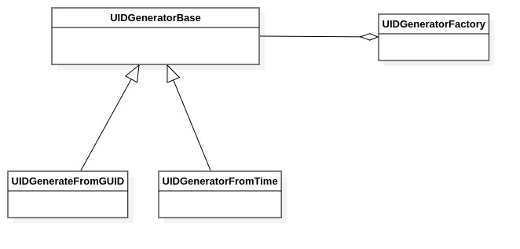

UID generation classes
======================

Introduction
------------

This section describes the classes and methods used to generate new UID (unique identifiers) to be used as instance UIDs.

The following classes are described in this chapter:

+-----------------------------------------------+---------------------------------------------+-------------------------------+
|C++ class                                      |Objective-C/Swift class                      |Description                    |
+===============================================+=============================================+===============================+
|:cpp:class:`imebra::UIDGeneratorFactory`       |:cpp:class:`ImebraUIDGeneratorFactory`       |Stored a complete DICOM        |
|                                               |                                             |structure                      |
+-----------------------------------------------+---------------------------------------------+-------------------------------+
|:cpp:class:`imebra::BaseUIDGenerator`          |:cpp:class:`ImebraBaseUIDGenerator`          |Stores a single DICOM tag      |
+-----------------------------------------------+---------------------------------------------+-------------------------------+
|:cpp:class:`imebra::SerialNumberUIDGenerator`  |:cpp:class:`ImebraSerialNumberUIDGenerator`  |Identifies a tag               |
+-----------------------------------------------+---------------------------------------------+-------------------------------+
|:cpp:class:`imebra::RandomUIDGenerator`        |:cpp:class:`ImebraRandomUIDGenerator`        |Read data from a tag           |
+-----------------------------------------------+---------------------------------------------+-------------------------------+

   Class diagram of the UID generators related classes

Imebra supplies two generators that are able to produce UIDs that can be used as SOP instances UID:

- :ref:`SerialNumberUIDGenerator`, to be used when the software has a mean to know its own serial number
- :ref:`RandomUIDGenerator`, to be used when the software is not able to retrieve its own serial number

In any case, the developer must acquire a root UID from the ISO authority.

Because the UID generators maintain an internal state which is necessary to generate unique IDs, the generators should
be allocated once when the program starts and then reused for the generation of every new UID.
:ref:`UIDGeneratorFactory` helps retrieving the generators allocated when the software started: register the allocated
generators in the :ref:`UIDGeneratorFactory` when the software starts and then get them from the factory when a new
UID is needed.

Factory
-------

.. _UIDGeneratorFactory:

UIDGeneratorFactory
...................

C++
,,,

.. doxygenclass:: imebra::UIDGeneratorFactory
   :members:

Objective-C/Swift
,,,,,,,,,,,,,,,,,

.. doxygenclass:: ImebraUIDGeneratorFactory
   :members:

Generators
----------

.. _BaseUIDGenerator:

BaseUIDGenerator
................

C++
,,,

.. doxygenclass:: imebra::BaseUIDGenerator
   :members:

Objective-C/Swift
,,,,,,,,,,,,,,,,,

.. doxygenclass:: ImebraBaseUIDGenerator
   :members:

.. _SerialNumberUIDGenerator:

SerialNumberUIDGenerator
........................

C++
,,,

.. doxygenclass:: imebra::SerialNumberUIDGenerator
   :members:

Objective-C/Swift
,,,,,,,,,,,,,,,,,

.. doxygenclass:: ImebraSerialNumberUIDGenerator
   :members:

.. _RandomUIDGenerator:

RandomUIDGenerator
..................

C++
,,,

.. doxygenclass:: imebra::RandomUIDGenerator
   :members:

Objective-C/Swift
,,,,,,,,,,,,,,,,,

.. doxygenclass:: ImebraRandomUIDGenerator
   :members:

