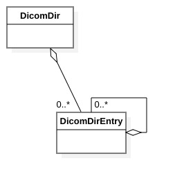

DICOMDIR classes
================

Introduction
------------

This chapter describes the classes and methods used to read and write DICOMDIR files.

The following classes are described in this chapter:

+-------------------------------------------+-----------------------------------------+-----------------------------------+
|C++ class                                  |Objective-C/Swift class                  |Description                        |
+===========================================+=========================================+===================================+
|:cpp:class:`imebra::DicomDir`              |:cpp:class:`ImebraDicomDir`              |Allows to access the DICOMDIR      |
|                                           |                                         |entries stored in a :ref:`DataSet` |
+-------------------------------------------+-----------------------------------------+-----------------------------------+
|:cpp:class:`imebra::MutableDicomDir`       |:cpp:class:`ImebraMutableDicomDir`       |Allows to create a DICOMDIR        |
|                                           |                                         |dataset                            |
+-------------------------------------------+-----------------------------------------+-----------------------------------+
|:cpp:class:`imebra::DicomDirEntry`         |:cpp:class:`ImebraDicomDirEntry`         |Represents a single DICOMDIR       |
|                                           |                                         |entry                              |
+-------------------------------------------+-----------------------------------------+-----------------------------------+
|:cpp:class:`imebra::MutableDicomDirEntry`  |:cpp:class:`ImebraMutableDicomDirEntry`  |Creates a single DICOMDIR entry    |
+-------------------------------------------+-----------------------------------------+-----------------------------------+

   Class diagram of the DICOMDIR related classes

DICOMDIR classes
----------------

DicomDir
........

C++
,,,

.. doxygenclass:: imebra::DicomDir
   :members:

Objective-C/Swift
,,,,,,,,,,,,,,,,,

.. doxygenclass:: ImebraDicomDir
   :members:

MutableDicomDir
...............

C++
,,,

.. doxygenclass:: imebra::MutableDicomDir
   :members:

Objective-C/Swift
,,,,,,,,,,,,,,,,,

.. doxygenclass:: ImebraMutableDicomDir
   :members:

DicomDirEntry
.............

C++
,,,

.. doxygenclass:: imebra::DicomDirEntry
   :members:

Objective-C/Swift
,,,,,,,,,,,,,,,,,

.. doxygenclass:: ImebraDicomDirEntry
   :members:

MutableDicomDirEntry
....................

C++
,,,

.. doxygenclass:: imebra::MutableDicomDirEntry
   :members:

Objective-C/Swift
,,,,,,,,,,,,,,,,,

.. doxygenclass:: ImebraMutableDicomDirEntry
   :members:

