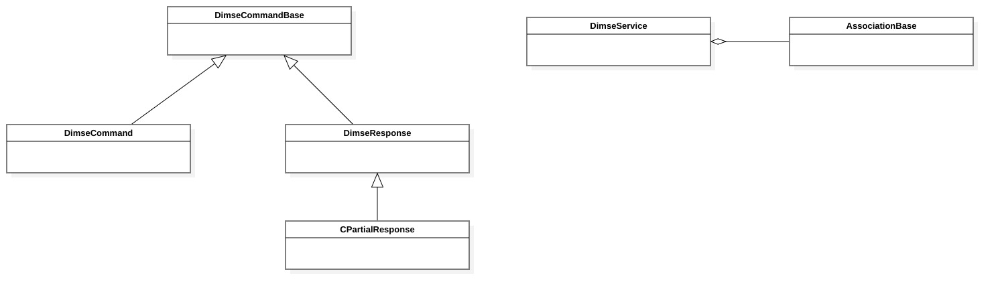
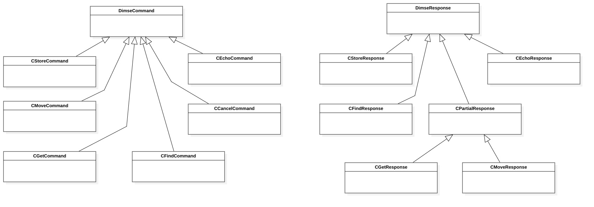
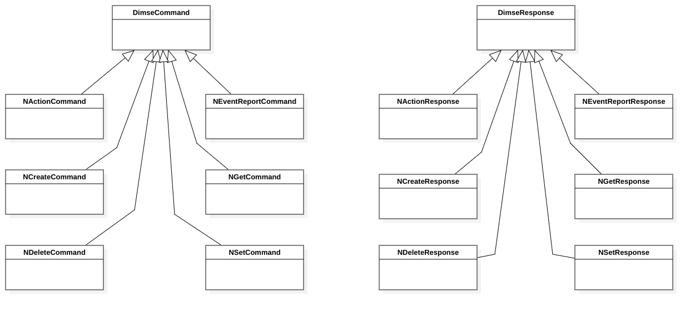

DIMSE classes
=============

Introduction
------------

This chapter describes the classes and methods responsible for constructing and parsing DIMSE commands.

The following classes are described in this chapter:

+-----------------------------------------------+---------------------------------------------+-------------------------------+
|C++ class                                      |Objective-C/Swift class                      |Description                    |
+===============================================+=============================================+===============================+
|:cpp:class:`imebra::DimseService`              |:cpp:class:`ImebraDimseService`              |Sends and receives DIMSE       |
|                                               |                                             |commands and responses         |
+-----------------------------------------------+---------------------------------------------+-------------------------------+
|:cpp:class:`imebra::DimseCommandBase`          |:cpp:class:`ImebraDimseCommandBase`          |Base class for DIMSE           |
|                                               |                                             |commands and responses         |
+-----------------------------------------------+---------------------------------------------+-------------------------------+
|:cpp:class:`imebra::DimseCommand`              |:cpp:class:`ImebraDimseCommand`              |Base class for DIMSE commands  |
+-----------------------------------------------+---------------------------------------------+-------------------------------+
|:cpp:class:`imebra::DimseResponse`             |:cpp:class:`ImebraDimseResponse`             |Base class for DIMSE responses |
+-----------------------------------------------+---------------------------------------------+-------------------------------+
|:cpp:class:`imebra::CStoreCommand`             |:cpp:class:`ImebraCStoreCommand`             |DIMSE C-STORE command          |
+-----------------------------------------------+---------------------------------------------+-------------------------------+
|:cpp:class:`imebra::CGetCommand`               |:cpp:class:`ImebraCGetCommand`               |DIMSE C-GET command            |
+-----------------------------------------------+---------------------------------------------+-------------------------------+
|:cpp:class:`imebra::CFindCommand`              |:cpp:class:`ImebraCFindCommand`              |DIMSE C-FIND command           |
+-----------------------------------------------+---------------------------------------------+-------------------------------+
|:cpp:class:`imebra::CMoveCommand`              |:cpp:class:`ImebraCMoveCommand`              |DIMSE C-MOVE command           |
+-----------------------------------------------+---------------------------------------------+-------------------------------+
|:cpp:class:`imebra::CEchoCommand`              |:cpp:class:`ImebraCEchoCommand`              |DIMSE C-ECHO command           |
+-----------------------------------------------+---------------------------------------------+-------------------------------+
|:cpp:class:`imebra::CCancelCommand`            |:cpp:class:`ImebraCCancelCommand`            |DIMSE C-CANCEL command         |
+-----------------------------------------------+---------------------------------------------+-------------------------------+
|:cpp:class:`imebra::CPartialResponse`          |:cpp:class:`ImebraCPartialResponse`          |Base clas for DIMSE partial    |
|                                               |                                             |responses                      |
+-----------------------------------------------+---------------------------------------------+-------------------------------+
|:cpp:class:`imebra::CStoreResponse`            |:cpp:class:`ImebraCStoreResponse`            |DIMSE C-STORE response         |
+-----------------------------------------------+---------------------------------------------+-------------------------------+
|:cpp:class:`imebra::CGetResponse`              |:cpp:class:`ImebraCGetResponse`              |DIMSE C-GET response           |
+-----------------------------------------------+---------------------------------------------+-------------------------------+
|:cpp:class:`imebra::CFindResponse`             |:cpp:class:`ImebraCFindResponse`             |DIMSE C-FIND response          |
+-----------------------------------------------+---------------------------------------------+-------------------------------+
|:cpp:class:`imebra::CMoveResponse`             |:cpp:class:`ImebraCMoveResponse`             |DIMSE C-MOVE response          |
+-----------------------------------------------+---------------------------------------------+-------------------------------+
|:cpp:class:`imebra::CEchoResponse`             |:cpp:class:`ImebraCEchoResponse`             |DIMSE C-ECHO response          |
+-----------------------------------------------+---------------------------------------------+-------------------------------+
|:cpp:class:`imebra::NEventReportCommand`       |:cpp:class:`ImebraNEventReportCommand`       |DIMSE N-EVENT-REPORT command   |
+-----------------------------------------------+---------------------------------------------+-------------------------------+
|:cpp:class:`imebra::NSetCommand`               |:cpp:class:`ImebraNSetCommand`               |DIMSE N-SET command            |
+-----------------------------------------------+---------------------------------------------+-------------------------------+
|:cpp:class:`imebra::NGetCommand`               |:cpp:class:`ImebraNGetCommand`               |DIMSE N-GET command            |
+-----------------------------------------------+---------------------------------------------+-------------------------------+
|:cpp:class:`imebra::NActionCommand`            |:cpp:class:`ImebraNActionCommand`            |DIMSE N-ACTION command         |
+-----------------------------------------------+---------------------------------------------+-------------------------------+
|:cpp:class:`imebra::NCreateCommand`            |:cpp:class:`ImebraNCreateCommand`            |DIMSE N-CREATE command         |
+-----------------------------------------------+---------------------------------------------+-------------------------------+
|:cpp:class:`imebra::NDeleteCommand`            |:cpp:class:`ImebraNDeleteCommand`            |DIMSE N-DELETE command         |
+-----------------------------------------------+---------------------------------------------+-------------------------------+
|:cpp:class:`imebra::NEventReportResponse`      |:cpp:class:`ImebraNEventReportResponse`      |DIMSE N-EVENT-REPORT response  |
+-----------------------------------------------+---------------------------------------------+-------------------------------+
|:cpp:class:`imebra::NSetResponse`              |:cpp:class:`ImebraNSetResponse`              |DIMSE N-SET response           |
+-----------------------------------------------+---------------------------------------------+-------------------------------+
|:cpp:class:`imebra::NGetCommand`               |:cpp:class:`ImebraNGetCommand`               |DIMSE N-GET response           |
+-----------------------------------------------+---------------------------------------------+-------------------------------+
|:cpp:class:`imebra::NActionResponse`           |:cpp:class:`ImebraNActionResponse`           |DIMSE N-ACTION response        |
+-----------------------------------------------+---------------------------------------------+-------------------------------+
|:cpp:class:`imebra::NCreateResponse`           |:cpp:class:`ImebraNCreateResponse`           |DIMSE N-CREATE response        |
+-----------------------------------------------+---------------------------------------------+-------------------------------+
|:cpp:class:`imebra::NDeleteResponse`           |:cpp:class:`ImebraNDeleteResponse`           |DIMSE N-DELETE response        |
+-----------------------------------------------+---------------------------------------------+-------------------------------+

   Class diagram of the DIMSE related classes

The DIMSE classes (DICOM Service) take care of transmitting and receiving DICOM commands
through a DICOM association (a :ref:`AssociationBase` derived class).

The main DIMSE class is :ref:`DimseService`, through which all the DICOM commands
and responses are sent and received.

Dimse

Commands and responses transmission and reception
-------------------------------------------------

.. _DimseService:

DimseService
............

C++
,,,

.. doxygenclass:: imebra::DimseService
   :members:
   
Objective-C/Swift
,,,,,,,,,,,,,,,,,

.. doxygenclass:: ImebraDimseService
   :members:
   

Commands and response classes
-----------------------------

All the DIMSE commands are identified by an unique ID, which can be retrieved via the :ref:`DimseService` class.

DIMSE responses are built from the DIMSE command and have the same ID of the command they are related to.

After receiving a command, use :cpp:member:`imebra::DimseCommand::getCommandType` to retrieve the command type, then cast the
received command to the proper type (:cpp:class:`imebra::CStoreCommand`, :cpp:class:`imebra::CMoveCommand`,
:cpp:class:`imebra::CGetCommand`, :cpp:class:`imebra::CFindCommand`, :cpp:class:`imebra::CEchoCommand`, :cpp:class:`imebra::CCancelCommand`,
:cpp:class:`imebra::NActionCommand`, :cpp:class:`imebra::NEventReportCommand`, :cpp:class:`imebra::NCreateCommand`,
:cpp:class:`imebra::NDeleteCommand`, :cpp:class:`imebra::NSetCommand`, :cpp:class:`imebra::NGetCommand`).
Instead of casting (e.g. when using the Golang wrapper) you can also call one of the following functions:

- :cpp:member:`imebra::DimseCommand::getAsCStoreCommand`
- :cpp:member:`imebra::DimseCommand::getAsCMoveCommand`
- :cpp:member:`imebra::DimseCommand::getAsCGetCommand`
- :cpp:member:`imebra::DimseCommand::getAsCFindCommand`
- :cpp:member:`imebra::DimseCommand::getAsCEchoCommand`
- :cpp:member:`imebra::DimseCommand::getAsCCancelCommand`
- :cpp:member:`imebra::DimseCommand::getAsNActionCommand`
- :cpp:member:`imebra::DimseCommand::getAsNEventReportCommand`
- :cpp:member:`imebra::DimseCommand::getAsNCreateCommand`
- :cpp:member:`imebra::DimseCommand::getAsNDeleteCommand`
- :cpp:member:`imebra::DimseCommand::getAsNSetCommand`
- :cpp:member:`imebra::DimseCommand::NGetCommand`

DimseCommandBase
................

C++
,,,

.. doxygenclass:: imebra::DimseCommandBase
   :members:

Objective-C/Swift
,,,,,,,,,,,,,,,,,

.. doxygenclass:: ImebraDimseCommandBase
   :members:

DimseCommand
............

C++
,,,

.. doxygenclass:: imebra::DimseCommand
   :members:
   
Objective-C/Swift
,,,,,,,,,,,,,,,,,

.. doxygenclass:: ImebraDimseCommand
   :members:
   

DimseResponse
.............

C++
,,,

.. doxygenclass:: imebra::DimseResponse
   :members:
   
Objective-C/Swift
,,,,,,,,,,,,,,,,,

.. doxygenclass:: ImebraDimseResponse
   :members:
   
   
C-Commands and responses
------------------------

   Class diagram of the DIMSE C commands classes

CStoreCommand
.............

C++
,,,

.. doxygenclass:: imebra::CStoreCommand
   :members:

Objective-C/Swift
,,,,,,,,,,,,,,,,,

.. doxygenclass:: ImebraCStoreCommand
   :members:

CGetCommand
...........

C++
,,,

.. doxygenclass:: imebra::CGetCommand
   :members:

Objective-C/Swift
,,,,,,,,,,,,,,,,,

.. doxygenclass:: ImebraCGetCommand
   :members:

CFindCommand
............

C++
,,,

.. doxygenclass:: imebra::CFindCommand
   :members:

Objective-C/Swift
,,,,,,,,,,,,,,,,,

.. doxygenclass:: ImebraCFindCommand
   :members:

CMoveCommand
............

C++
,,,

.. doxygenclass:: imebra::CMoveCommand
   :members:

Objective-C/Swift
,,,,,,,,,,,,,,,,,

.. doxygenclass:: ImebraCMoveCommand
   :members:

CEchoCommand
............

C++
,,,

.. doxygenclass:: imebra::CEchoCommand
   :members:
   
Objective-C/Swift
,,,,,,,,,,,,,,,,,

.. doxygenclass:: ImebraCEchoCommand
   :members:
   

CCancelCommand
..............

C++
,,,

.. doxygenclass:: imebra::CCancelCommand
   :members:
   
Objective-C/Swift
,,,,,,,,,,,,,,,,,

.. doxygenclass:: ImebraCCancelCommand
   :members:
   

CPartialResponse
................

C++
,,,

.. doxygenclass:: imebra::CPartialResponse
   :members:
   
Objective-C/Swift
,,,,,,,,,,,,,,,,,

.. doxygenclass:: ImebraCPartialResponse
   :members:
   

CStoreResponse
..............

C++
,,,

.. doxygenclass:: imebra::CStoreResponse
   :members:

Objective-C/Swift
,,,,,,,,,,,,,,,,,

.. doxygenclass:: ImebraCStoreResponse
   :members:

CGetResponse
............

C++
,,,

.. doxygenclass:: imebra::CGetResponse
   :members:
   
Objective-C/Swift
,,,,,,,,,,,,,,,,,

.. doxygenclass:: ImebraCGetResponse
   :members:
   

CFindResponse
.............

C++
,,,

.. doxygenclass:: imebra::CFindResponse
   :members:
   
Objective-C/Swift
,,,,,,,,,,,,,,,,,

.. doxygenclass:: ImebraCFindResponse
   :members:
   
   

CMoveResponse
.............

C++
,,,

.. doxygenclass:: imebra::CMoveResponse
   :members:

Objective-C/Swift
,,,,,,,,,,,,,,,,,

.. doxygenclass:: ImebraCMoveResponse
   :members:

CEchoResponse
.............

C++
,,,

.. doxygenclass:: imebra::CEchoResponse
   :members:

Objective-C/Swift
,,,,,,,,,,,,,,,,,

.. doxygenclass:: ImebraCEchoResponse
   :members:

N-Commands and responses
------------------------
  

   Class diagram of the DIMSE N commands classes

NEventReportCommand
...................

C++
,,,

.. doxygenclass:: imebra::NEventReportCommand
   :members:
   
Objective-C/Swift
,,,,,,,,,,,,,,,,,

.. doxygenclass:: ImebraNEventReportCommand
   :members:
   

NSetCommand
...........

C++
,,,

.. doxygenclass:: imebra::NSetCommand
   :members:
   
Objective-C/Swift
,,,,,,,,,,,,,,,,,

.. doxygenclass:: ImebraNSetCommand
   :members:
   

NGetCommand
...........

C++
,,,

.. doxygenclass:: imebra::NGetCommand
   :members:
   
Objective-C/Swift
,,,,,,,,,,,,,,,,,

.. doxygenclass:: ImebraNGetCommand
   :members:
   

NActionCommand
..............

C++
,,,

.. doxygenclass:: imebra::NActionCommand
   :members:
   
Objective-C/Swift
,,,,,,,,,,,,,,,,,

.. doxygenclass:: ImebraNActionCommand
   :members:
   

NCreateCommand
..............

C++
,,,

.. doxygenclass:: imebra::NCreateCommand
   :members:
   
Objective-C/Swift
,,,,,,,,,,,,,,,,,

.. doxygenclass:: ImebraNCreateCommand
   :members:
   

NDeleteCommand
..............

C++
,,,

.. doxygenclass:: imebra::NDeleteCommand
   :members:
   
Objective-C/Swift
,,,,,,,,,,,,,,,,,

.. doxygenclass:: ImebraNDeleteCommand
   :members:
   

NEventReportResponse
....................

C++
,,,

.. doxygenclass:: imebra::NEventReportResponse
   :members:
   
Objective-C/Swift
,,,,,,,,,,,,,,,,,

.. doxygenclass:: ImebraNEventReportResponse
   :members:
   

NSetResponse
............

C++
,,,

.. doxygenclass:: imebra::NSetResponse
   :members:
   
Objective-C/Swift
,,,,,,,,,,,,,,,,,

.. doxygenclass:: ImebraNSetResponse
   :members:
   

NGetResponse
............

C++
,,,

.. doxygenclass:: imebra::NGetResponse
   :members:
   
Objective-C/Swift
,,,,,,,,,,,,,,,,,

.. doxygenclass:: ImebraNGetResponse
   :members:
   

NActionResponse
...............

C++
,,,

.. doxygenclass:: imebra::NActionResponse
   :members:
   
Objective-C/Swift
,,,,,,,,,,,,,,,,,

.. doxygenclass:: ImebraNActionResponse
   :members:
   

NCreateResponse
...............

C++
,,,

.. doxygenclass:: imebra::NCreateResponse
   :members:
   
Objective-C/Swift
,,,,,,,,,,,,,,,,,

.. doxygenclass:: ImebraNCreateResponse
   :members:
   

NDeleteResponse
...............

C++
,,,

.. doxygenclass:: imebra::NDeleteResponse
   :members:
   
Objective-C/Swift
,,,,,,,,,,,,,,,,,

.. doxygenclass:: ImebraNDeleteResponse
   :members:
   
