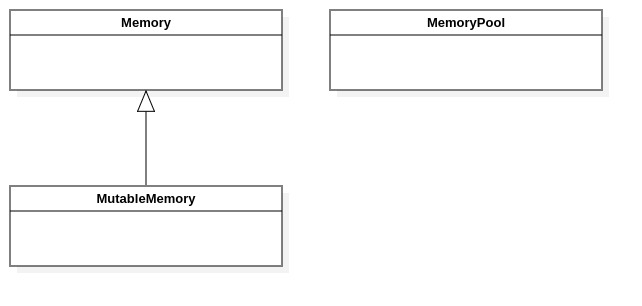

Memory management classes
=========================

Introduction
------------

This chapter describes the classes and methods responsible for allocating and accessing the memory used by the Imebra classes.

The following classes are described in this chapter:

+-----------------------------------------------+---------------------------------------------+-------------------------------+
|C++ class                                      |Objective-C/Swift class                      |Description                    |
+===============================================+=============================================+===============================+
|:cpp:class:`imebra::Memory`                    |:cpp:class:`ImebraMemory`                    |Allows to read the memory      |
|                                               |                                             |content                        |
+-----------------------------------------------+---------------------------------------------+-------------------------------+
|:cpp:class:`imebra::MutableMemory`             |:cpp:class:`ImebraMutableMemory`             |Allows to read and write the   |
|                                               |                                             |memory content                 |
+-----------------------------------------------+---------------------------------------------+-------------------------------+
|:cpp:class:`imebra::MemoryPool`                |:cpp:class:`ImebraMemoryPool`                |Allocatess or reuse a memory   |
|                                               |                                             |block                          |
+-----------------------------------------------+---------------------------------------------+-------------------------------+

The inner working classes of the Imebra library use the :ref:`MemoryPool` class to allocate blocks of memory.

When a memory block allocated by :ref:`MemoryPool` is released then it is not deleted immediately but instead it is kept for
a while so it can be reused by classes than need a similar amount of memory.

   Class diagram of the memory classes

Memory access
-------------

Memory
......

C++
,,,

.. doxygenclass:: imebra::Memory
   :members:

Objective-C/Swift
,,,,,,,,,,,,,,,,,

.. doxygenclass:: ImebraMemory
   :members:

MutableMemory
.............

C++
,,,

.. doxygenclass:: imebra::MutableMemory
   :members:

Objective-C/Swift
,,,,,,,,,,,,,,,,,

.. doxygenclass:: ImebraMutableMemory
   :members:

Memory allocation
-----------------

.. _MemoryPool:

MemoryPool
..........

C++
,,,

.. doxygenclass:: imebra::MemoryPool
   :members:

Objective-C/Swift
,,,,,,,,,,,,,,,,,

.. doxygenclass:: ImebraMemoryPool
   :members:

