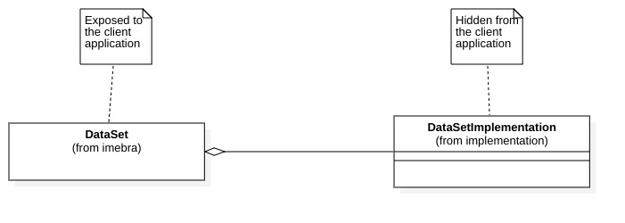
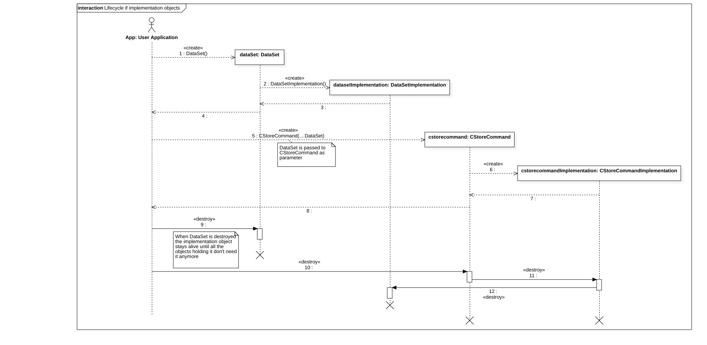

Objects lifecycle and Object ownership
======================================

This chapter describes the lifecycle of the Imebra Objects and who is responsible for managing it.

Objects are handles
-------------------

The internal objects allocated by Imebra are not exposed directly to the client application: instead of the real object, a proxy one is presented to the
client application. This is true both for Imebra objects allocated by the library itself and for the ones allocated by the client application.

This means that for each class visible by the client application (e.g. :ref:`DataSet`) there is a counterpart class (e.g. DataSetImplementation)
which actually performs all the heavy lifting: :ref:`DataSet` (the exposed class) just holds a shared pointer to DataSetImplementation and forwards
all the function calls to it.

When an Imebra object is passed as parameter to a method, then a shared pointer referencing the hidden object is passed to the underlying method:
this means that the client application can freely delete the Imebra objects it sees while resting assured that the actual working object will
be deleted only when all the methods and classes using it have finished with it.

   Example of Imebra public class and implementation class

   The DataSetImplementation object stays alive until all the objects needing it dismiss it.

