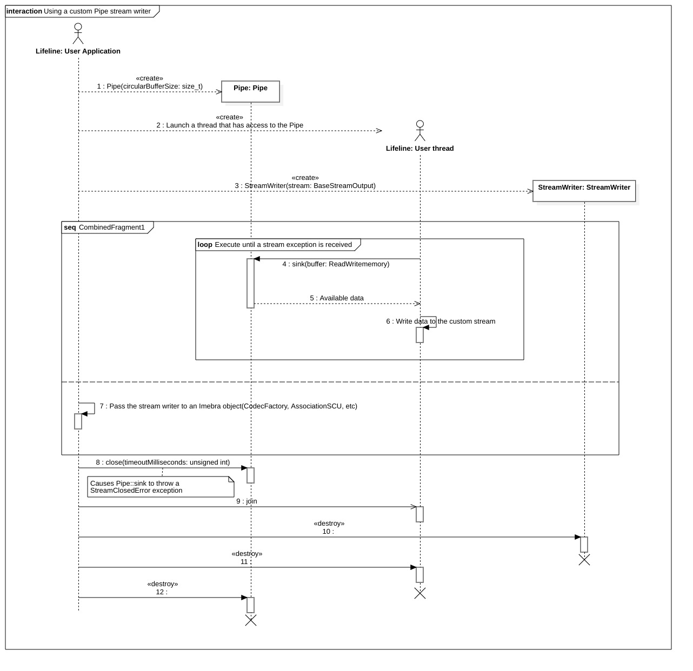

Pipes and custom streams
========================

The Pipe class can be used to provide custom streams for the ACSE and DIMSE services.

A separate thread must be used to feed a Pipe (to supply a custom reading stream) or to sink data from a Pipe
(to provide a custom writing stream).

   Sequence diagram for the implementation of a custom output pipe

