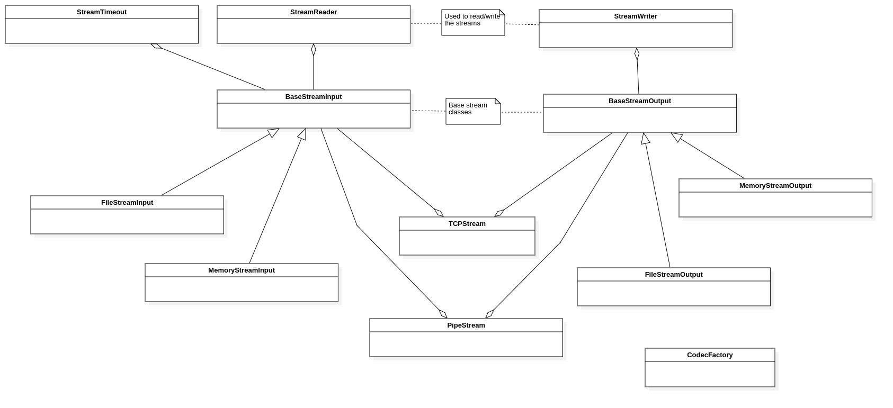
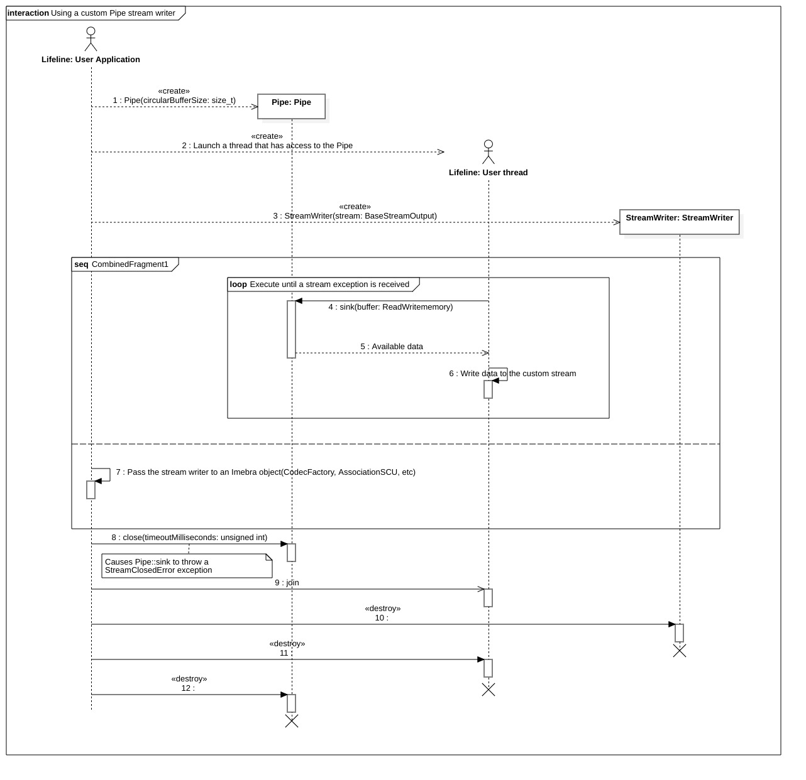

Stream classes
==============

Introduction
------------

The classes described in this chapter are used to load and store DICOM data structures (represented by a :ref:`DataSet`)
and to send and receive DICOM messages.

The following classes are described in this chapter:

+----------------------------------------+--------------------------------------+-------------------------------+
|C++ class                               |Objective-C/Swift class               |Description                    |
+========================================+======================================+===============================+
|:cpp:class:`imebra::CodecFactory`       |:cpp:class:`ImebraCodecFactory`       |Load/Save a DICOM structure    |
+----------------------------------------+--------------------------------------+-------------------------------+
|:cpp:class:`imebra::BaseStreamInput`    |:cpp:class:`ImebraBaseStreamInput`    |Base class for input streams   |
+----------------------------------------+--------------------------------------+-------------------------------+
|:cpp:class:`imebra::BaseStreamOutput`   |:cpp:class:`ImebraBaseStreamOutput`   |Base class for output streams  |
+----------------------------------------+--------------------------------------+-------------------------------+
|:cpp:class:`imebra::StreamReader`       |:cpp:class:`ImebraStreamReader`       |Read from an input stream      |
+----------------------------------------+--------------------------------------+-------------------------------+
|:cpp:class:`imebra::StreamWriter`       |:cpp:class:`ImebraStreamWriter`       |Write into an output stream    |
+----------------------------------------+--------------------------------------+-------------------------------+
|:cpp:class:`imebra::FileStreamInput`    |:cpp:class:`ImebraFileStreamInput`    |File input stream              |
+----------------------------------------+--------------------------------------+-------------------------------+
|:cpp:class:`imebra::FileStreamOutput`   |:cpp:class:`ImebraFileStreamOutput`   |File output stream             |
+----------------------------------------+--------------------------------------+-------------------------------+
|:cpp:class:`imebra::MemoryStreamInput`  |:cpp:class:`ImebraMemoryStreamInput`  |Memory input stream            |
+----------------------------------------+--------------------------------------+-------------------------------+
|:cpp:class:`imebra::MemoryStreamOutput` |:cpp:class:`ImebraMemoryStreamOutput` |Memory output stream           |
+----------------------------------------+--------------------------------------+-------------------------------+
|:cpp:class:`imebra::StreamTimeout`      |:cpp:class:`ImebraStreamTimeout`      |Causes a stream to fail after  |
|                                        |                                      |a timeout has expired          |
+----------------------------------------+--------------------------------------+-------------------------------+
|:cpp:class:`imebra::PipeStream`         |:cpp:class:`ImebraPipeStream`         |Allow to implement custom      |
|                                        |                                      |input and output streams       |
+----------------------------------------+--------------------------------------+-------------------------------+
|:cpp:class:`imebra::TCPStream`          |:cpp:class:`ImebraTCPStream`          |Implement an input and output  |
|                                        |                                      |stream on a TCP connection     |
+----------------------------------------+--------------------------------------+-------------------------------+
|:cpp:class:`imebra::TCPListener`        |:cpp:class:`ImebraTCPListener`        |Listen for incoming TCP        |
|                                        |                                      |connections                    |
+----------------------------------------+--------------------------------------+-------------------------------+
|:cpp:class:`imebra::TCPAddress`         |:cpp:class:`ImebraTCPAddress`         |Represents a TCP address       |
+----------------------------------------+--------------------------------------+-------------------------------+
|:cpp:class:`imebra::TCPPassiveAddress`  |:cpp:class:`ImebraTCPPassiveAddress`  |Represents a passive TCP       |
|                                        |                                      |address (used by the connection|
|                                        |                                      |listener)                      |
+----------------------------------------+--------------------------------------+-------------------------------+
|:cpp:class:`imebra::TCPActiveAddress`   |:cpp:class:`ImebraTCPActiveAddress`   |Represents an active TCP       |
|                                        |                                      |address (used to connect to    |
|                                        |                                      |a peer)                        |
+----------------------------------------+--------------------------------------+-------------------------------+

   Class diagram of the stream related classes

The easiest way to load or store a :ref:`DataSet` object is by using the static methods of the `CodecFactory`_ class.

All the Imebra Stream Classes (file, memory, tcp, pipe) derive from `BaseStreamInput`_ or/and `BaseStreamOutput`_.

`BaseStreamInput`_ represents an input stream (you can read from it) while `BaseStreamOutput`_ represents an output
stream (you can write into it). However, both classes don't expose reading and writing methods: in order to read or 
write from/to a stream the client application must use the `StreamReader`_ or `StreamWriter`_.

Several `StreamReader`_ or `StreamWriter`_ can share a single `BaseStreamInput`_ or `BaseStreamOutput`_.

Stream classes
--------------

CodecFactory
............

C++
,,,

.. doxygenclass:: imebra::CodecFactory
   :members:

Objective-C/Swift
,,,,,,,,,,,,,,,,,

.. doxygenclass:: ImebraCodecFactory
   :members:

BaseStreamInput
...............

C++
,,,

.. doxygenclass:: imebra::BaseStreamInput
   :members:

Objective-C/Swift
,,,,,,,,,,,,,,,,,

.. doxygenclass:: ImebraBaseStreamInput
   :members:

BaseStreamOutput
................

C++
,,,

.. doxygenclass:: imebra::BaseStreamOutput
   :members:

Objective-C/Swift
,,,,,,,,,,,,,,,,,

.. doxygenclass:: ImebraBaseStreamOutput
   :members:

StreamReader
............

C++
,,,

.. doxygenclass:: imebra::StreamReader
   :members:

Objective-C/Swift
,,,,,,,,,,,,,,,,,

.. doxygenclass:: ImebraStreamReader
   :members:

StreamWriter
............

C++
,,,

.. doxygenclass:: imebra::StreamWriter
   :members:

Objective-C/Swift
,,,,,,,,,,,,,,,,,

.. doxygenclass:: ImebraStreamWriter
   :members:

FileStreamInput
...............

C++
,,,

.. doxygenclass:: imebra::FileStreamInput
   :members:

Objective-C/Swift
,,,,,,,,,,,,,,,,,

.. doxygenclass:: ImebraFileStreamInput
   :members:

FileStreamOutput
................

C++
,,,

.. doxygenclass:: imebra::FileStreamOutput
   :members:

Objective-C/Swift
,,,,,,,,,,,,,,,,,

.. doxygenclass:: ImebraFileStreamOutput
   :members:

MemoryStreamInput
.................

C++
,,,

.. doxygenclass:: imebra::MemoryStreamInput
   :members:

Objective-C/Swift
,,,,,,,,,,,,,,,,,

.. doxygenclass:: ImebraMemoryStreamInput
   :members:

MemoryStreamOutput
..................

C++
,,,

.. doxygenclass:: imebra::MemoryStreamOutput
   :members:

Objective-C/Swift
,,,,,,,,,,,,,,,,,

.. doxygenclass:: ImebraMemoryStreamOutput
   :members:

StreamTimeout
.............

C++
,,,

.. doxygenclass:: imebra::StreamTimeout
   :members:

Objective-C/Swift
,,,,,,,,,,,,,,,,,

.. doxygenclass:: ImebraStreamTimeout
   :members:

Pipe classes
------------

The Pipe class can be used to provide custom streams for the ACSE and DIMSE services or for any operation that
takes a `StreamReader`_ or `StreamWriter`_ as parameter.

An example of custom stream could be:

- a secure TCP connection
- a connection through a dedicated custom network
- etc.

A separate thread must be used to feed a Pipe (to supply a custom reading stream) or to sink data from a Pipe
(to provide a custom writing stream).

   Sequence diagram for the implementation of a custom output pipe

Pipe
....

C++
,,,

.. doxygenclass:: imebra::PipeStream
   :members:

Objective-C/Swift
,,,,,,,,,,,,,,,,,

.. doxygenclass:: ImebraPipeStream
   :members:

TCP classes
-----------

The TCP classes can be used with :cpp:class:`imebra::StreamWriter` and :cpp:class:`imebra::StreamReader` to
send and receive data through a TCP stream.

A TCP server socket (a socket that listen for incoming connection) can be realized with the class
:cpp:class:`imebra::TCPListener`, while a TCP client (a socket that initiates a connection with a
server) can be realized with the class :cpp:class:`imebra::TCPStream`.

:cpp:class:`imebra::TCPListener` creates a new :cpp:class:`imebra::TCPStream` for each accepted incoming connection.

Both :cpp:class:`imebra::TCPListener` and :cpp:class:`imebra::TCPStream` expose blocking methods (except for
the constructors which connect to the peer in non-blocking mode).
You can exit a blocking method by closing the socket or by calling the terminate() method.

.. _TCPStream:

TCPStream
.........

C++
,,,

.. doxygenclass:: imebra::TCPStream
   :members:

Objective-C/Swift
,,,,,,,,,,,,,,,,,

.. doxygenclass:: ImebraTCPStream
   :members:

TCPListener
...........

C++
,,,

.. doxygenclass:: imebra::TCPListener
   :members:

Objective-C/Swift
,,,,,,,,,,,,,,,,,

.. doxygenclass:: ImebraTCPListener
   :members:

TCPAddress
..........

C++
,,,

.. doxygenclass:: imebra::TCPAddress
   :members:

Objective-C/Swift
,,,,,,,,,,,,,,,,,

.. doxygenclass:: ImebraTCPAddress
   :members:

TCPPassiveAddress
.................

C++
,,,

.. doxygenclass:: imebra::TCPPassiveAddress
   :members:

Objective-C/Swift
,,,,,,,,,,,,,,,,,

.. doxygenclass:: ImebraTCPPassiveAddress
   :members:

TCPActiveAddress
................

C++
,,,

.. doxygenclass:: imebra::TCPActiveAddress
   :members:

Objective-C/Swift
,,,,,,,,,,,,,,,,,

.. doxygenclass:: ImebraTCPActiveAddress
   :members:

