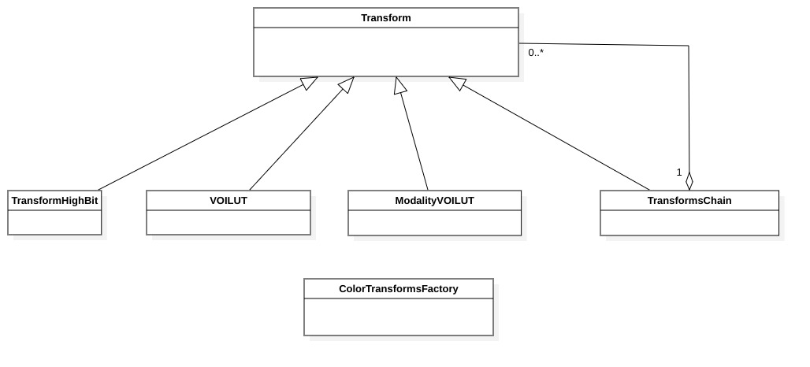

.. _transform-classes:

Transforms classes
==================

Introduction
------------

This chapter describes the transform classes. Transform classes apply a transform algorithm to an input image and return the
result in an output image.

The following classes are described in this chapter:

+-----------------------------------------------+---------------------------------------------+-------------------------------+
|C++ class                                      |Objective-C/Swift class                      |Description                    |
+===============================================+=============================================+===============================+
|:cpp:class:`imebra::Transform`                 |:cpp:class:`ImebraTransform`                 |Base class for all the         |
|                                               |                                             |transforms                     |
+-----------------------------------------------+---------------------------------------------+-------------------------------+
|:cpp:class:`imebra::TransformsChain`           |:cpp:class:`ImebraTransformsChain`           |Apply a sequence of transforms |
+-----------------------------------------------+---------------------------------------------+-------------------------------+
|:cpp:class:`imebra::VOILUT`                    |:cpp:class:`ImebraVOILUT`                    |Apply a presentation VOI or    |
|                                               |                                             |LUT                            |
+-----------------------------------------------+---------------------------------------------+-------------------------------+
|:cpp:class:`imebra::VOIDescription`            |:cpp:class:`ImebraVOIDescription`            |Describes the VOI's parameters |
|                                               |                                             |(center, width, function)      |
+-----------------------------------------------+---------------------------------------------+-------------------------------+
|:cpp:class:`imebra::ModalityVOILUT`            |:cpp:class:`ImebraModalityVOILUT`            |Apply the modality VOI or      |
|                                               |                                             |LUT                            |
+-----------------------------------------------+---------------------------------------------+-------------------------------+
|:cpp:class:`imebra::TransformHighBit`          |:cpp:class:`ImebraTransformHighBit`          |Shift the pixels bits          |
+-----------------------------------------------+---------------------------------------------+-------------------------------+
|:cpp:class:`imebra::ColorTransformsFactory`    |:cpp:class:`ImebraColorTransformsFactory`    |Transform the color space      |
+-----------------------------------------------+---------------------------------------------+-------------------------------+

   Class diagram of the transforms classes

Base Transform class
--------------------

Transform
.........

C++
,,,

.. doxygenclass:: imebra::Transform
   :members:

Objective-C/Swift
,,,,,,,,,,,,,,,,,

.. doxygenclass:: ImebraTransform
   :members:

TransformsChain
...............

C++
,,,

.. doxygenclass:: imebra::TransformsChain
   :members:

Objective-C/Swift
,,,,,,,,,,,,,,,,,

.. doxygenclass:: ImebraTransformsChain
   :members:

Modality and Presentation transforms
------------------------------------

VOILUT
......

C++
,,,

.. doxygenclass:: imebra::VOILUT
   :members:

Objective-C/Swift
,,,,,,,,,,,,,,,,,

.. doxygenclass:: ImebraVOILUT
   :members:

VOIDescription
..............

C++
,,,

.. doxygenclass:: imebra::VOIDescription
   :members:

Objective-C/Swift
,,,,,,,,,,,,,,,,,

.. doxygenclass:: ImebraVOIDescription
   :members:

LUT
...

C++
,,,

.. doxygenclass:: imebra::LUT
   :members:

Objective-C/Swift
,,,,,,,,,,,,,,,,,

.. doxygenclass:: ImebraLUT
   :members:

ModalityVOILUT
..............

C++
,,,

.. doxygenclass:: imebra::ModalityVOILUT
   :members:

Objective-C/Swift
,,,,,,,,,,,,,,,,,

.. doxygenclass:: ImebraModalityVOILUT
   :members:

Rendering transforms
--------------------

TransformHighBit
................

C++
,,,

.. doxygenclass:: imebra::TransformHighBit
   :members:

Objective-C/Swift
,,,,,,,,,,,,,,,,,

.. doxygenclass:: ImebraTransformHighBit
   :members:

ColorTransformsFactory
......................

C++
,,,

.. doxygenclass:: imebra::ColorTransformsFactory
   :members:

Objective-C/Swift
,,,,,,,,,,,,,,,,,

.. doxygenclass:: ImebraColorTransformsFactory
   :members:
